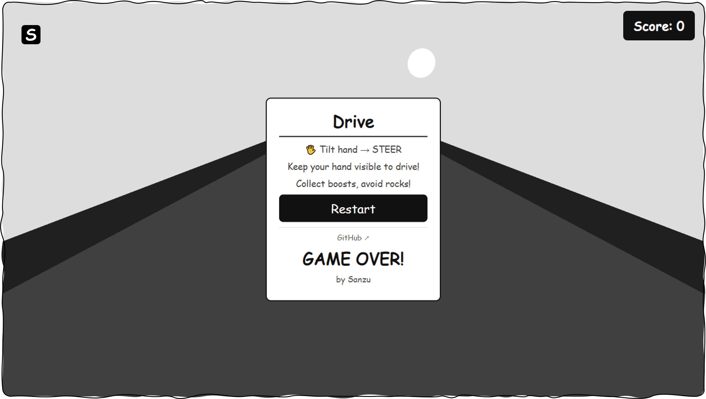

# Drive

An interactive 3D browser car game controlled entirely by **hand gestures** through your webcam. Tilt your hand left or right to steer, collect items, and dodge obstacles in real time!

[](https://heysanzu.github.io/gameDrive)



---  

```bash
git clone https://github.com/heysanzu/gameDrive.git
cd gameDrive
```
<p align="left">
  
</p>

Maintained by [@heysanzu](https://github.com/heysanzu)
